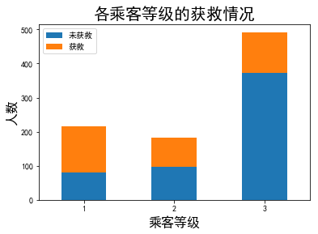

## Kaggle案例：泰坦尼克号生存预测分析（使用逻辑回归，随机森林分类模型，AdaBoost分类模型,GBDT分类模型）

### 数据读取

1. 读取数据，查看字段

   ```python
   data_train = pd.read_csv("Train.csv")
   data_train.columns
   ```

   ```
   Index(['PassengerId', 'Survived', 'Pclass', 'Name', 'Sex', 'Age', 'SibSp','Parch', 'Ticket', 'Fare', 'Cabin', 'Embarked'],dtype='object')
   ```

2. 数据简单描述，查看是否缺失值

   ```python
   data_train.info()
   ```

   ```
   <class 'pandas.core.frame.DataFrame'>
   RangeIndex: 891 entries, 0 to 890
   Data columns (total 12 columns):
   PassengerId    891 non-null int64
   Survived       891 non-null int64
   Pclass         891 non-null int64
   Name           891 non-null object
   Sex            891 non-null object
   Age            714 non-null float64
   SibSp          891 non-null int64
   Parch          891 non-null int64
   Ticket         891 non-null object
   Fare           891 non-null float64
   Cabin          204 non-null object
   Embarked       889 non-null object
   dtypes: float64(2), int64(5), object(5)
   memory usage: 83.6+ KB
   ```

   Age字段和Cabin字段有缺失值

3. 数据简单描述，查看数值字段的分布情况

   ```python
   data_train.describe()
   ```

   |       | PassengerId | Survived   | Pclass     | Age        | SibSp      | Parch      | Fare       |
   | ----- | ----------- | ---------- | ---------- | ---------- | ---------- | ---------- | ---------- |
   | count | 891.000000  | 891.000000 | 891.000000 | 714.000000 | 891.000000 | 891.000000 | 891.000000 |
   | mean  | 446.000000  | 0.383838   | 2.308642   | 29.699118  | 0.523008   | 0.381594   | 32.204208  |
   | std   | 257.353842  | 0.486592   | 0.836071   | 14.526497  | 1.102743   | 0.806057   | 49.693429  |
   | min   | 1.000000    | 0.000000   | 1.000000   | 0.420000   | 0.000000   | 0.000000   | 0.000000   |
   | 25%   | 223.500000  | 0.000000   | 2.000000   | 20.125000  | 0.000000   | 0.000000   | 7.910400   |
   | 50%   | 446.000000  | 0.000000   | 3.000000   | 28.000000  | 0.000000   | 0.000000   | 14.454200  |
   | 75%   | 668.500000  | 1.000000   | 3.000000   | 38.000000  | 1.000000   | 0.000000   | 31.000000  |
   | max   | 891.000000  | 1.000000   | 3.000000   | 80.000000  | 8.000000   | 6.000000   | 512.329200 |

   从mean字段中可知，大概0.3838的人获救，乘客平均年龄29.7岁

### 通过可视化查看数据分布

1. 获救人数情况可视化

   ```
   fig = plt.figure()
   fig.set(alpha=0.2)  # 设定图表颜色alpha参数
   data_train.Survived.value_counts().plot(kind='bar')
   plt.title("获救情况",fontsize=20)
   plt.ylabel("人数",fontsize=16)
   plt.xlabel("获就情况",fontsize=16)
   plt.xticks([0,1],['0(没获救)','1(获救)'], fontsize=14)
   plt.xticks(rotation=0)
   plt.show()
   print(data_train.Survived.value_counts())
   ```

   

   ```
   0    549
   1    342
   Name: Survived, dtype: int64
   ```

   从上述统计可知，大于1/3的人获救了

2. 乘客等级情况可视化

   ```
   data_train.Pclass.value_counts().plot(kind="bar")
   plt.ylabel("人数",fontsize=16)
   plt.xlabel("乘客等级",fontsize=16)
   plt.title("乘客等级分布",fontsize=20)
   plt.xticks(rotation=0)
   plt.show()
   print(data_train.Pclass.value_counts())
   ```

   

   ```
   3    491
   1    216
   2    184
   Name: Pclass, dtype: int64
   ```

   从上述统计可知，乘客等级是3的乘客最多，其次是1等级，2等级

3. 按年龄看获救情况可视化

   ```python
   plt.scatter(data_train.Survived, data_train.Age)
   plt.ylabel("年龄",fontsize=16)                         
   plt.grid(True,axis='y') 
   plt.title("按年龄看获救分布 (1为获救)",fontsize=20)
   plt.show()
   ```

   

   从上述统计可知，不同年龄段都有人获救，也有人没有获救

4. 各等级的乘客年龄分布

   ```python
   data_train.Age[data_train.Pclass == 1].plot(kind='kde')   
   data_train.Age[data_train.Pclass == 2].plot(kind='kde')
   data_train.Age[data_train.Pclass == 3].plot(kind='kde')
   plt.xlabel("年龄",fontsize=16)
   plt.ylabel("密度",fontsize=16) 
   plt.title("各等级的乘客年龄分布",fontsize=20)
   plt.legend(('头等舱', '2等舱','3等舱')) 
   plt.show()
   ```

   

   从上述统计可知，3个不同的船舱的年龄总体趋势似乎也一致，23等舱和3等舱乘客20岁左右的人最多，1等舱40岁左右的最多

5. 各登船口岸人数可视化

   ```pyt
   data_train.Embarked.value_counts().plot(kind='bar')
   plt.title("各登船口岸上船人数",fontsize=20)
   plt.xlabel("登船口岸",fontsize=16)
   plt.ylabel("人数",fontsize=16)  
   plt.xticks(rotation=0)
   plt.show()
   ```

   

   从上述统计可知，登船港口人数按照S、C、Q递减，而且S远多于另外俩港口

### 每个属性与获救情况可视化

1. 各乘客等级的获救情况

   ```python
   Survived_0 = data_train.Pclass[data_train.Survived == 0].value_counts()
   Survived_1 = data_train.Pclass[data_train.Survived == 1].value_counts()
   df=pd.DataFrame({'获救':Survived_1, '未获救':Survived_0})
   df.plot(kind='bar',stacked=True)
   plt.title("各乘客等级的获救情况",fontsize=20)
   plt.xlabel("乘客等级",fontsize=16) 
   plt.ylabel("人数",fontsize=16) 
   plt.xticks(rotation=0)
   plt.legend()
   plt.show()
   ```

   

   从上述统计可知，等级1的乘客获救的机会比较大

2. 各性别的获救情况

   ```python
   Survived_0 = data_train.Sex[data_train.Survived == 0].value_counts()
   Survived_1 = data_train.Sex[data_train.Survived == 1].value_counts()
   df=pd.DataFrame({'获救':Survived_1, '未获救':Survived_0})
   df.plot(kind='bar', stacked=True)
   plt.title("不同性别的获救情况",fontsize=20)
   plt.xlabel("获救",fontsize=16) 
   plt.ylabel("人数",fontsize=16)
   plt.xticks(rotation=0)
   plt.legend()
   plt.show()
   ```

   

   从上述统计可知，女性乘客获救的机会比较大

3. 堂兄弟姐妹的获救情况

   ```python
   g = data_train.groupby(['SibSp','Survived'])
   df = pd.DataFrame(g.count()['PassengerId'])
   df.head(8)
   ```

   

4. 父母对获救情况

   ```python
   g = data_train.groupby(['Parch','Survived'])
   df = pd.DataFrame(g.count()['PassengerId'])
   df.head()
   ```

   

### 数据处理

1. 缺失值处理(补充Age，Cabin，Embarked字段缺失值)

   ```python
   #补充Age字段的缺失值
   data_train['Age']=data_train['Age'].fillna(data_train['Age'].mean())
   #按Cabin有无数据，将这个属性处理成Yes和No两种类型
   def set_Cabin_type(df):
       df.loc[ (df.Cabin.notnull()), 'Cabin' ] = "Yes"
       df.loc[ (df.Cabin.isnull()), 'Cabin' ] = "No"
       return df
   data_train = set_Cabin_type(data_train)
   #对Embarked字段进行填充数据
   data_train['Embarked']=data_train['Embarked'].fillna('S')
   ```

   ```python
   data_train.info()
   ```

   ```
   <class 'pandas.core.frame.DataFrame'>
   RangeIndex: 891 entries, 0 to 890
   Data columns (total 12 columns):
   PassengerId    891 non-null int64
   Survived       891 non-null int64
   Pclass         891 non-null int64
   Name           891 non-null object
   Sex            891 non-null object
   Age            891 non-null float64
   SibSp          891 non-null int64
   Parch          891 non-null int64
   Ticket         891 non-null object
   Fare           891 non-null float64
   Cabin          891 non-null object
   Embarked       891 non-null object
   dtypes: float64(2), int64(5), object(5)
   memory usage: 83.6+ KB
   ```

2. 数据One-hot处理(对Cabin，Embarked，Sex，Pclass字段进行One-hot编码)

   ```python
   #One-hot编码
   dummies_Cabin = pd.get_dummies(data_train['Cabin'], prefix= 'Cabin')
   dummies_Embarked = pd.get_dummies(data_train['Embarked'], prefix= 'Embarked')
   dummies_Sex = pd.get_dummies(data_train['Sex'], prefix= 'Sex')
   dummies_Pclass = pd.get_dummies(data_train['Pclass'], prefix= 'Pclass')
   
   df = pd.concat([data_train, dummies_Cabin, dummies_Embarked, dummies_Sex, dummies_Pclass], axis=1)
   df.drop(['Pclass', 'Name', 'Sex', 'Ticket', 'Cabin', 'Embarked'], axis=1, inplace=True)
   ```

3. 数据标准化处理(对Age，Fare字段进行标准化处理)

   ```python
   a=df.Age
   df['Age_scaled'] = (a - a.mean()) / (a.std())
   df=df.drop('Age',axis=1)
   b=df.Fare
   df['Fare_scaled'] = (b - b.mean()) / (b.std())
   df=df.drop('Fare',axis=1)
   ```

4. 查看数据

   |      | PassengerId | Survived | SibSp | Parch | Cabin_No | Cabin_Yes | Embarked_C | Embarked_Q | Embarked_S | Sex_female | Sex_male | Pclass_1 | Pclass_2 | Pclass_3 | Age_scaled    | Fare_scaled |
   | ---- | ----------- | -------- | ----- | ----- | -------- | --------- | ---------- | ---------- | ---------- | ---------- | -------- | -------- | -------- | -------- | ------------- | ----------- |
   | 0    | 1           | 0        | 1     | 0     | 1        | 0         | 0          | 0          | 1          | 0          | 1        | 0        | 0        | 1        | -5.921480e-01 | -0.502163   |
   | 1    | 2           | 1        | 1     | 0     | 0        | 1         | 1          | 0          | 0          | 1          | 0        | 1        | 0        | 0        | 6.384304e-01  | 0.786404    |
   | 2    | 3           | 1        | 0     | 0     | 1        | 0         | 0          | 0          | 1          | 1          | 0        | 0        | 0        | 1        | -2.845034e-01 | -0.488580   |
   | 3    | 4           | 1        | 1     | 0     | 0        | 1         | 0          | 0          | 1          | 1          | 0        | 1        | 0        | 0        | 4.076970e-01  | 0.420494    |
   | 4    | 5           | 0        | 0     | 0     | 1        | 0         | 0          | 0          | 1          | 0          | 1        | 0        | 0        | 1        | 4.076970e-01  | -0.486064   |
   | 5    | 6           | 0        | 0     | 0     | 1        | 0         | 0          | 1          | 0          | 0          | 1        | 0        | 0        | 1        | 4.371893e-15  | -0.477848   |
   | 6    | 7           | 0        | 0     | 0     | 0        | 1         | 0          | 0          | 1          | 0          | 1        | 1        | 0        | 0        | 1.869009e+00  | 0.395591    |
   | 7    | 8           | 0        | 3     | 1     | 1        | 0         | 0          | 0          | 1          | 0          | 1        | 0        | 0        | 1        | -2.130371e+00 | -0.223957   |
   | 8    | 9           | 1        | 0     | 2     | 1        | 0         | 0          | 0          | 1          | 1          | 0        | 0        | 0        | 1        | -2.075923e-01 | -0.424018   |
   | 9    | 10          | 1        | 1     | 0     | 1        | 0         | 1          | 0          | 0          | 1          | 0        | 0        | 1        | 0        | -1.207437e+00 | -0.042931   |

### 建立模型

1. 把需要的feature字段取出来，转成numpy格式，得到输入集和输出集

   ```python
   train_df = df.filter(regex='Survived|Age_.*|SibSp|Parch|Fare_.*|Cabin_.*|Embarked_.*|Sex_.*|Pclass_.*')
   train_np = train_df.values
   # y即Survival结果
   y = train_np[:, 0]
   # X即特征属性值
   X = train_np[:, 1:]
   train_x,test_x,train_y,test_y=ms.train_test_split(X,y,test_size=0.25,random_state=7)
   ```

2. 建立LogisticRegression模型

   ```python
   clf = linear_model.LogisticRegression(penalty='l1', tol=1e-4)
   print(ms.cross_val_score(clf,train_x,train_y,cv=5,scoring='f1_weighted').mean())
   clf.fit(X, y)  
   ```

   LogisticRegression模型得分：0.8139827547425945

3. 随机森林分类器

   ```python
   model1 = RandomForestClassifier(random_state=1,max_depth=5,n_estimators = 300,min_samples_split=2,min_samples_leaf=2)
   print(ms.cross_val_score(model1,train_x,train_y,cv=5,scoring='f1_weighted').mean())
   model1.fit(X, y)
   ```

   随机森林模型得分：0.834122973878633

4. 建立AdaBoost分类器

   ```python
   model2=AdaBoostClassifier(st.DecisionTreeClassifier(max_depth=10),n_estimators=300,random_state=7)
   print(ms.cross_val_score(model2,train_x,train_y,cv=5,scoring='f1_weighted').mean())
   model2.fit(X, y)
   ```

   AdaBoost模型得分：0.8071757660912219

5. 建立GBDT分类器

   ```python
   model3=GradientBoostingClassifier(n_estimators = 200,learning_rate=0.1,random_state=10)
   print(ms.cross_val_score(model3,train_x,train_y,cv=5,scoring='f1_weighted').mean())
   model3.fit(X, y)
   ```

   GBDT分类器模型得分：0.8355047319222952

6. 从上述四种模型的得分可以看出，GBDT模型的得分比其他三种模型得分高，其次是随机森林分类, 逻辑回归模型，最后是AdaBoost分类模型

7. 以随机森林模型为例，得到特征重要性分布，并可视化

   ```python
   fi=model1.feature_importances_
   fn=train_df.columns[1:]
   plt.title('RandomForest_feature_importance',fontsize=16)
   plt.ylabel('Importance',fontsize=12)
   plt.tick_params(labelsize=10)
   plt.grid(axis='y',linestyle=":")
   sorted_indices=fi.argsort()[::-1]
   pos=np.arange(sorted_indices.size)
   plt.bar(pos,fi[sorted_indices],facecolor='deepskyblue',edgecolor='steelblue')
   plt.xticks(pos,fn[sorted_indices],rotation=90)
   ```

   

   我们可以看到，在随机森林模型中，性别这个特征的重要性最大，其次是票价，乘客等级等特征

### 测试模型

 1. 将测试集数据和训练集做一样的处理

    ```python
    data_test = pd.read_csv("test.csv")
    # 接着我们对test_data做和train_data中一致的特征变换
    data_test.loc[ (data_test.Fare.isnull()), 'Fare' ] = 0
    #补充Age的缺失值
    data_test['Age']=data_test['Age'].fillna(data_test['Age'].mean())
    #按Cabin有无数据，将这个属性处理成Yes和No两种类型
    def set_Cabin_type(df):
        df.loc[ (df.Cabin.notnull()), 'Cabin' ] = "Yes"
        df.loc[ (df.Cabin.isnull()), 'Cabin' ] = "No"
        return df
    data_train = set_Cabin_type(data_test)
    
    # one-hot编码
    dummies_Cabin = pd.get_dummies(data_test['Cabin'], prefix= 'Cabin')
    dummies_Embarked = pd.get_dummies(data_test['Embarked'], prefix= 'Embarked')
    dummies_Sex = pd.get_dummies(data_test['Sex'], prefix= 'Sex')
    dummies_Pclass = pd.get_dummies(data_test['Pclass'], prefix= 'Pclass')
    
    df_test = pd.concat([data_test, dummies_Cabin, dummies_Embarked, dummies_Sex, dummies_Pclass], axis=1)
    df_test.drop(['Pclass', 'Name', 'Sex', 'Ticket', 'Cabin', 'Embarked'], axis=1, inplace=True)
    
    # 标准化处理数据
    a=df_test.Age
    df_test['Age_scaled'] = (a - a.mean()) / (a.std())
    df_test=df_test.drop('Age',axis=1)
    b=df_test.Fare
    df_test['Fare_scaled'] = (b - b.mean()) / (b.std())
    df_test=df_test.drop('Fare',axis=1)
    df_test.head(10)
    ```

 2. 将测试数据分别带入上述模型，得到的结果存储到csv文件中

    ```python
    test = df_test.filter(regex='Age_.*|SibSp|Parch|Fare_.*|Cabin_.*|Embarked_.*|Sex_.*|Pclass_.*')
    
    #分别用建立的三种模型进行预测
    predictions0 = clf.predict(test)
    predictions1 = model1.predict(test)
    predictions2 = model2.predict(test)
    predictions3 = model3.predict(test)
    
    #保存结果到csv文件
    result = pd.DataFrame({'PassengerId':data_test['PassengerId'].values, 'Survived_L':predictions0.astype(np.int32),'Survived_R':predictions1.astype(np.int32),'Survived_A':predictions2.astype(np.int32),'Survived_G':predictions3.astype(np.int32)})
    result.to_csv("predictions.csv", index=False)
    ```

3. 查看测试集数据的预测结果

   ```python
   pd.read_csv("predictions.csv").head(20)
   ```

   |      | PassengerId | Survived_A | Survived_G | Survived_L | Survived_R |
   | ---- | ----------- | ---------- | ---------- | ---------- | ---------- |
   | 0    | 892         | 0          | 0          | 0          | 0          |
   | 1    | 893         | 0          | 0          | 0          | 0          |
   | 2    | 894         | 1          | 0          | 0          | 0          |
   | 3    | 895         | 0          | 0          | 0          | 0          |
   | 4    | 896         | 0          | 0          | 1          | 0          |
   | 5    | 897         | 0          | 0          | 0          | 0          |
   | 6    | 898         | 0          | 0          | 1          | 1          |
   | 7    | 899         | 0          | 0          | 0          | 0          |
   | 8    | 900         | 1          | 1          | 1          | 1          |
   | 9    | 901         | 0          | 0          | 0          | 0          |
   | 10   | 902         | 0          | 0          | 0          | 0          |
   | 11   | 903         | 0          | 0          | 0          | 0          |
   | 12   | 904         | 1          | 1          | 1          | 1          |
   | 13   | 905         | 0          | 0          | 0          | 0          |
   | 14   | 906         | 1          | 1          | 1          | 1          |
   | 15   | 907         | 1          | 1          | 1          | 1          |
   | 16   | 908         | 0          | 0          | 0          | 0          |
   | 17   | 909         | 1          | 0          | 0          | 0          |
   | 18   | 910         | 1          | 1          | 1          | 0          |
   | 19   | 911         | 0          | 0          | 1          | 1          |

   从上述统计可见，'Survived_L'表示逻辑回归的预测结果，'Survived_R'表示随机森林的预测结果，'Survived_A'表示AdaBoost的预测结果，'Survived_G'表示GBDT的预测结果，不同的模型，预测的结果存在不同。


