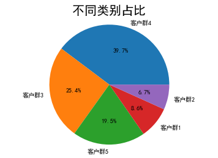
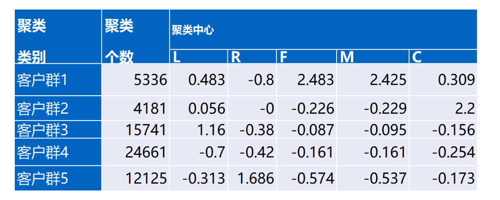
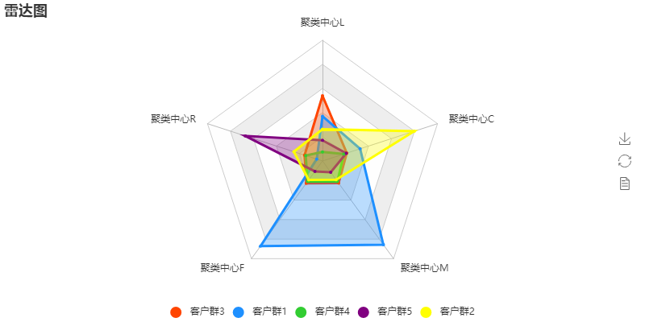
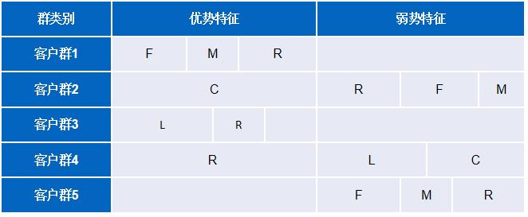
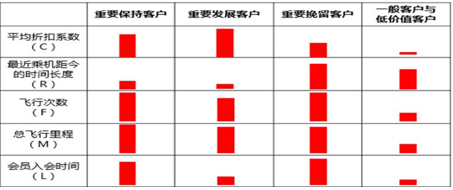

## 基于聚类算法的航空公司用户价值分析

### 开发环境和工具

python3+numpy+pandas+matplotlib+sklearn+jupyternotebook

### 项目背景

信息时代的来临使得企业营销焦点从产品中心转变为客户中心，企业会针对不同价值的客户指定优化的个性化服务方案，采取不同的营销策略，将有限营销资源集中于高价值客户，实现企业利润最大化。

### 项目目标

1. 借助航空公司客户数据，对客户进行分类
2. 对不同客户类别进行特征分析，比较不同类别客户的客户价值
3. 对不同价值的客户类别提供个性化服务，提供相应的营销策略

### 基于LRFMC模型的客户分析

在RFM模型的基础上，引入LRFMC模型进行客户价值衡量

L(Load_time): 客户入会时间距观测窗口结束的月数

R(Recent): 最近一次消费与截止时间的间隔

F(Frequency): 客户在某段时间内的消费次数

M(Monetary): 客户在某段时间内的消费金额

C(Avg_discount): 客户在观测窗口内乘坐仓位时所对应的折扣系数的平均值

### 读取数据

1. 读取数据(data/air_data.csv)，共有62988条样本，44个特征

2. 查看是否有缺失值

   ```
   <class 'pandas.core.frame.DataFrame'>
   RangeIndex: 62988 entries, 0 to 62987
   Data columns (total 44 columns):
   MEMBER_NO                  62988 non-null int64
   FFP_DATE                   62988 non-null object
   FIRST_FLIGHT_DATE          62988 non-null object
   GENDER                     62985 non-null object
   FFP_TIER                   62988 non-null int64
   WORK_CITY                  60719 non-null object
   WORK_PROVINCE              59740 non-null object
   WORK_COUNTRY               62962 non-null object
   AGE                        62568 non-null float64
   LOAD_TIME                  62988 non-null object
   FLIGHT_COUNT               62988 non-null int64
   BP_SUM                     62988 non-null int64
   EP_SUM_YR_1                62988 non-null int64
   EP_SUM_YR_2                62988 non-null int64
   SUM_YR_1                   62437 non-null float64
   SUM_YR_2                   62850 non-null float64
   SEG_KM_SUM                 62988 non-null int64
   WEIGHTED_SEG_KM            62988 non-null float64
   LAST_FLIGHT_DATE           62988 non-null object
   AVG_FLIGHT_COUNT           62988 non-null float64
   AVG_BP_SUM                 62988 non-null float64
   BEGIN_TO_FIRST             62988 non-null int64
   LAST_TO_END                62988 non-null int64
   AVG_INTERVAL               62988 non-null float64
   MAX_INTERVAL               62988 non-null int64
   ADD_POINTS_SUM_YR_1        62988 non-null int64
   ADD_POINTS_SUM_YR_2        62988 non-null int64
   EXCHANGE_COUNT             62988 non-null int64
   avg_discount               62988 non-null float64
   P1Y_Flight_Count           62988 non-null int64
   L1Y_Flight_Count           62988 non-null int64
   P1Y_BP_SUM                 62988 non-null int64
   L1Y_BP_SUM                 62988 non-null int64
   EP_SUM                     62988 non-null int64
   ADD_Point_SUM              62988 non-null int64
   Eli_Add_Point_Sum          62988 non-null int64
   L1Y_ELi_Add_Points         62988 non-null int64
   Points_Sum                 62988 non-null int64
   L1Y_Points_Sum             62988 non-null int64
   Ration_L1Y_Flight_Count    62988 non-null float64
   Ration_P1Y_Flight_Count    62988 non-null float64
   Ration_P1Y_BPS             62988 non-null float64
   Ration_L1Y_BPS             62988 non-null float64
   Point_NotFlight            62988 non-null int64
   dtypes: float64(12), int64(24), object(8)
   memory usage: 21.1+ MB
   ```

   发现有缺失值，后面会进行缺失值处理

3. 查看数据前十行

   | MEMBER_NO | FFP_DATE | FIRST_FLIGHT_DATE | GENDER     | FFP_TIER | WORK_CITY | WORK_PROVINCE | WORK_COUNTRY | AGE  | LOAD_TIME | ...       | ADD_Point_SUM | Eli_Add_Point_Sum | L1Y_ELi_Add_Points | Points_Sum | L1Y_Points_Sum | Ration_L1Y_Flight_Count | Ration_P1Y_Flight_Count | Ration_P1Y_BPS | Ration_L1Y_BPS | Point_NotFlight |      |
   | --------- | -------- | ----------------- | ---------- | -------- | --------- | ------------- | ------------ | ---- | --------- | --------- | ------------- | ----------------- | ------------------ | ---------- | -------------- | ----------------------- | ----------------------- | -------------- | -------------- | --------------- | ---- |
   | 0         | 54993    | 2006/11/2         | 2008/12/24 | 男       | 6         | .             | 北京         | CN   | 31.0      | 2014/3/31 | ...           | 39992             | 114452             | 111100     | 619760         | 370211                  | 0.509524                | 0.490476       | 0.487221       | 0.512777        | 50   |
   | 1         | 28065    | 2007/2/19         | 2007/8/3   | 男       | 6         | NaN           | 北京         | CN   | 42.0      | 2014/3/31 | ...           | 12000             | 53288              | 53288      | 415768         | 238410                  | 0.514286                | 0.485714       | 0.489289       | 0.510708        | 33   |
   | 2         | 55106    | 2007/2/1          | 2007/8/30  | 男       | 6         | .             | 北京         | CN   | 40.0      | 2014/3/31 | ...           | 15491             | 55202              | 51711      | 406361         | 233798                  | 0.518519                | 0.481481       | 0.481467       | 0.518530        | 26   |
   | 3         | 21189    | 2008/8/22         | 2008/8/23  | 男       | 5         | Los Angeles   | CA           | US   | 64.0      | 2014/3/31 | ...           | 0                 | 34890              | 34890      | 372204         | 186100                  | 0.434783                | 0.565217       | 0.551722       | 0.448275        | 12   |
   | 4         | 39546    | 2009/4/10         | 2009/4/15  | 男       | 6         | 贵阳          | 贵州         | CN   | 48.0      | 2014/3/31 | ...           | 22704             | 64969              | 64969      | 338813         | 210365                  | 0.532895                | 0.467105       | 0.469054       | 0.530943        | 39   |
   | 5         | 56972    | 2008/2/10         | 2009/9/29  | 男       | 6         | 广州          | 广东         | CN   | 64.0      | 2014/3/31 | ...           | 2460              | 29783              | 29783      | 343121         | 152538                  | 0.456522                | 0.543478       | 0.608233       | 0.391764        | 15   |
   | 6         | 44924    | 2006/3/22         | 2006/3/29  | 男       | 6         | 乌鲁木齐市    | 新疆         | CN   | 46.0      | 2014/3/31 | ...           | 12320             | 50009              | 50009      | 298873         | 175673                  | 0.504950                | 0.495050       | 0.495048       | 0.504948        | 29   |
   | 7         | 22631    | 2010/4/9          | 2010/4/9   | 女       | 6         | 温州市        | 浙江         | CN   | 50.0      | 2014/3/31 | ...           | 9500              | 49334              | 49334      | 351198         | 193601                  | 0.589041                | 0.410959       | 0.522078       | 0.477919        | 14   |
   | 8         | 32197    | 2011/6/7          | 2011/7/1   | 男       | 5         | DRANCY        | NaN          | FR   | 50.0      | 2014/3/31 | ...           | 500               | 32200              | 32200      | 295158         | 168028                  | 0.410714                | 0.589286       | 0.483459       | 0.516537        | 7    |
   | 9         | 31645    | 2010/7/5          | 2010/7/5   | 女       | 6         | 温州          | 浙江         | CN   | 43.0      | 2014/3/31 | ...           | 0                 | 47052              | 47052      | 251907         | 143958                  | 0.390625                | 0.609375       | 0.526951       | 0.473044        | 16   |

   10 rows × 44 columns

### 数据预处理

1. 去除票件为空的数据

   ```python
   exp1 = airline_data["SUM_YR_1"].notnull()
   exp2 = airline_data["SUM_YR_2"].notnull()
   exp = exp1 & exp2
   airline_notnull = airline_data.loc[exp,:]
   print('删除缺失记录后数据的形状为：',airline_notnull.shape)
   ```

   ```
   删除缺失记录后数据的形状为： (62299, 44)
   ```

2. 只保留票价不为0，平均折扣率不为0，总飞行公里数大于0的记录

   ```
   index1 = airline_notnull['SUM_YR_1'] != 0
   index2 = airline_notnull['SUM_YR_2'] != 0
   index3 = (airline_notnull['SEG_KM_SUM']> 0) & (airline_notnull['avg_discount'] != 0)
   airline = airline_notnull[(index1 | index2) & index3]
   print('删除异常记录后数据的形状为：',airline.shape)
   ```

   ```
   删除异常记录后数据的形状为： (62044, 44)
   ```

### 构建LRFMC模型特征

1. 选取所需的特征，构建LRFMC模型特征，合并特征

   ```python
   ## 选取需求特征
   airline_selection = airline[["FFP_DATE","LOAD_TIME","LAST_TO_END","FLIGHT_COUNT","SEG_KM_SUM","avg_discount"]] 
   airline_selection.head()
   ## 构建L特征（客户入会时间距观测窗口结束的月数）
   L= pd.to_datetime(airline_selection["LOAD_TIME"]) - pd.to_datetime(airline_selection["FFP_DATE"])
   L = L.astype("str").str.split().str[0]
   L = L.astype("int")/30
   ## 合并特征
   airline_features = pd.concat([L,airline_selection.iloc[:,2:]],axis = 1)
   ```

2. 查看LRFMC模型数据

   |      | L         | LAST_TO_END | FLIGHT_COUNT | SEG_KM_SUM | avg_discount |
   | ---- | --------- | ----------- | ------------ | ---------- | ------------ |
   | 0    | 90.200000 | 1           | 210          | 580717     | 0.961639     |
   | 1    | 86.566667 | 7           | 140          | 293678     | 1.252314     |
   | 2    | 87.166667 | 11          | 135          | 283712     | 1.254676     |
   | 3    | 68.233333 | 97          | 23           | 281336     | 1.090870     |
   | 4    | 60.533333 | 5           | 152          | 309928     | 0.970658     |

3. 查看每个特征的基本属性(总个数，最大值，最小值，平均值等)，由于每个特征最大值和最小值相差太大，后面需要进行标准化处理

   |       | L            | LAST_TO_END  | FLIGHT_COUNT | SEG_KM_SUM    | avg_discount |
   | ----- | ------------ | ------------ | ------------ | ------------- | ------------ |
   | count | 62044.000000 | 62044.000000 | 62044.000000 | 62044.000000  | 62044.000000 |
   | mean  | 49.623036    | 172.532703   | 11.971359    | 17321.694749  | 0.722180     |
   | std   | 28.262697    | 181.526164   | 14.110619    | 21052.728111  | 0.184833     |
   | min   | 12.166667    | 1.000000     | 2.000000     | 368.000000    | 0.136017     |
   | 25%   | 24.500000    | 29.000000    | 3.000000     | 4874.000000   | 0.613085     |
   | 50%   | 42.600000    | 105.000000   | 7.000000     | 10200.000000  | 0.712162     |
   | 75%   | 72.733333    | 260.000000   | 15.000000    | 21522.500000  | 0.809293     |
   | max   | 114.566667   | 731.000000   | 213.000000   | 580717.000000 | 1.500000     |

4. 数据标准化处理

   ```python
   airline_features_scaled= (airline_features - airline_features.mean()) / (airline_features.std())
   airline_features_scaled.head()
   ```

   标准化处理后的数据

   ```
   L	LAST_TO_END	FLIGHT_COUNT	SEG_KM_SUM	avg_discount
   0	1.435707	-0.944948	14.034016	26.761154	1.295540
   1	1.307152	-0.911894	9.073213	13.126864	2.868176
   2	1.328381	-0.889859	8.718869	12.653481	2.880950
   3	0.658476	-0.416098	0.781585	12.540622	1.994714
   4	0.386032	-0.922912	9.923636	13.898736	1.344335
   ```

### 建模分析

 1. 使用KMeans算法进行聚类模型构建，本案例设定分为五类

    ```python
    kmeans_model = KMeans(n_clusters = 5,random_state=123)
    ```

 2. 训练模型，统计不同类别样本的数目，并查看聚类中心

    ```
    最终每个类别的数目为：
     2    24661
    0    15741
    3    12125
    1     5336
    4     4181
    dtype: int64
    ```

    

    ```
    array([[ 1.16063114, -0.37723101, -0.08693538, -0.09485761, -0.15582812],
           [ 0.48332845, -0.79938326,  2.4832016 ,  2.42472391,  0.30863003],
           [-0.70022909, -0.41487223, -0.16115608, -0.16097537, -0.25507251],
           [-0.31357211,  1.68622472, -0.57397357, -0.53680287, -0.17306867],
           [ 0.05189162, -0.00324595, -0.22666647, -0.23105177,  2.19223968]])
    ```

3. 将上述结果进行展示

   

<<<<<<< HEAD
4. 使用pyecharts统计对五个客户群进行雷达图绘制
=======
4. 使用pyecharts对五个客户群进行雷达图绘制
>>>>>>> 721518e976f2415859e132185906415b00869f52

   

5. 比较各个特征在客户群间的大小，总结出每个群体的优势和弱势特征

   

6. 航空公司制定的客户标准

   

7. 分析不同客户群

   1. 客户群1：重要保持客户，占比8.6%
   2. 客户群2：重要发展客户，占比6.7%
   3. 客户群3：重要挽留客户，占比25.5%
   4. 客户群4和客户群5：一般客户与低价值客户，占比59.3%

8. 相应营销策略

   1. 客户群1：该客户群是航空公司的VIP用户，优先将资源投放在他们身上，需经常和该客户群进行联系，对他们做到一对一精准营销，为他们提供更好的VIP服务
   2. 客户群2：该客户群的入会时间短，但是飞行次数，飞行里程，平均折扣系数，最近乘机时间都占优势，是航空公司需要重点发展的客户群，是公司的潜在价值客户，可以给他们提供一定的优惠政策以及高端客户活动等，加强这类客户的满意度，使他们逐渐成为公司的忠实客户
   3. 客户群3：该客户群和客户群1相比，飞行次数，飞行里程以及入会时间都占优势，但是已经很长时间没有乘坐本航空公司的航班了。航空公司在运营过程中要积极推测这类客户的异常情况，进行竞争分析，观察其他航空公司有什么营销策略，然后采取有针对性的营销手段，延长客户的生命周期。
   4. 客户群4和客户群5：这两个客户群占的比例最大，是一些普通的客户，可能只是在机票打折的时候才会乘坐本航班。
